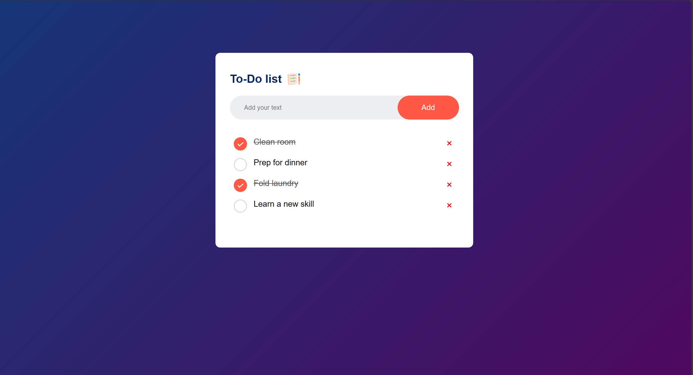

# 📝 To-Do List App

A simple and interactive **To-Do List App** built with HTML, CSS, and JavaScript.  
It helps users manage daily tasks by adding, marking as complete, and deleting them.

---

## 🚀 Features
- ➕ Add new tasks quickly.
- ✅ Mark tasks as complete (strikethrough effect).
- ❌ Delete tasks easily.
- 🎨 Clean, modern, and responsive UI.
- 💾 Persistent (can be extended with localStorage).

---

## 🛠️ Tech Stack
- **HTML5**
- **CSS3**
- **JavaScript (Vanilla JS)**

---

## 📸 Preview



*(Replace `preview.png` with your actual screenshot filename, e.g. `Screenshot 2025-09-26 180100.png` in your repo.)*

---

## ⚙️ Installation & Setup

1. Clone this repository:
   ```bash
   git clone https://github.com/AnasKhan322/Todo-List.git
   cd Todo-List
